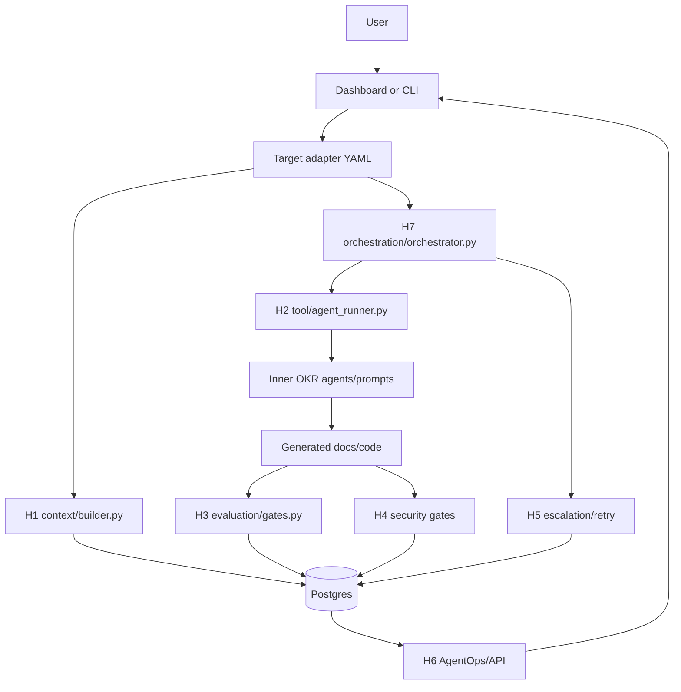

# AI Harness Architecture By Folder

## Purpose

This repository is an AI SDLC Harness workspace. The harness is the outer control plane. Target folders, such as `AINative_OKR_Claude_GHCP/`, provide inner prompts, agents, requirements, and product-specific source.

The architecture uses this pattern:

```text
Outer AI Harness Control Plane
  -> target adapter
  -> target prompt/agent system
  -> generated SDLC artifacts and app code
  -> deterministic gates
  -> Postgres state, logs, metrics, and artifacts
```

## Root Structure

```text
AI-Harness-Boilerplate/
  apps/
  packages/
  harness/
  AINative_OKR_Claude_GHCP/
  docs/
  docker-compose.yml
  .env.example
```

| Folder | Role |
| --- | --- |
| `apps/` | User-facing dashboard and API for launching and observing harness runs |
| `packages/ai-harness/` | Reusable harness engine |
| `harness/` | Harness architecture blueprint, H1-H7 policies, target registry |
| `AINative_OKR_Claude_GHCP/` | First target project: imported OKR prompt/agent/Spec-Kit source |
| `docs/` | Architecture, flow, and operating documentation |
| `docker-compose.yml` | Shared infrastructure, especially Postgres for harness persistence |

## `packages/ai-harness/`

Reusable Python harness engine. Source code lives directly under `src/` and is split by harness-engineering layer so each concern has an obvious home.

```text
packages/ai-harness/
  pyproject.toml
  README.md
  harness.yaml
  harness.sdlc.yaml
  evals/
  src/
    cli.py
    __main__.py
    core/
      config.py
    interfaces/
      cli.py
    context/
      builder.py
    tool/
      agent_runner.py
    evaluation/
      gates.py
    security/
      secret_scanner.py
    governance/
      escalation.py
    agentops/
      storage.py
      state_store.py
      db_logger.py
    orchestration/
      orchestrator.py
```

| File | Layer | Responsibility |
| --- | --- | --- |
| `src/interfaces/cli.py` | Interface/H7 | CLI entrypoint: `run`, `resume`, `status` |
| `src/core/config.py` | Core | Load target adapter YAML and phase definitions |
| `src/context/builder.py` | H1 | Build controlled context packet and manifest |
| `src/tool/agent_runner.py` | H2 | Provider adapter for Claude Code and Codex CLI |
| `src/evaluation/gates.py` | H3 | Deterministic verification gates |
| `src/security/secret_scanner.py` | H4 | Secret scanning primitive used by security gates |
| `src/governance/escalation.py` | H5 | Escalation policy for failed phases |
| `src/agentops/storage.py` | H6 | Postgres schema and persistence for state/artifacts |
| `src/agentops/state_store.py` | H6 | DB-backed run state facade |
| `src/agentops/db_logger.py` | H6 | Phase, gate, and event logging into Postgres |
| `src/orchestration/orchestrator.py` | H7 | Phase loop, retry, resume, cost updates |

CLI execution:

```powershell
$env:PYTHONPATH='packages/ai-harness/src'
python -m cli run `
  --repo .\AINative_OKR_Claude_GHCP `
  --config .\packages\ai-harness\targets\okr-ghcp\harness.okr.yaml `
  --feature "Build the OKR web application"
```

## `harness/`

Reusable architecture blueprint. This folder is not target implementation code; it documents and standardizes the harness pattern.

```text
harness/
  README.md
  layers/
    H1-context/policy.md
    H2-tool/policy.md
    H3-evaluation/policy.md
    H4-security/policy.md
    H5-governance/policy.md
    H6-agentops/policy.md
    H7-orchestration/policy.md
  targets/
    okr-ghcp/target.yaml
```

| Folder | Purpose |
| --- | --- |
| `layers/H1-context/` | Context contracts, packets, manifests, injection, assertions |
| `layers/H2-tool/` | Tool/runtime policy and command boundaries |
| `layers/H3-evaluation/` | Artifact, marker, shell, and review gates |
| `layers/H4-security/` | Secret scan, dependency audit, prompt/context safety |
| `layers/H5-governance/` | Retry limits, escalation, approval boundaries |
| `layers/H6-agentops/` | Cost, logs, metrics, traces, run observability |
| `layers/H7-orchestration/` | Phase graph, resume, repair, boss/expanded modes |
| `targets/okr-ghcp/` | Registry metadata for the OKR target |

## `AINative_OKR_Claude_GHCP/`

First harness target. This folder is an inner AI-SDLC source package, not the reusable harness engine.

```text
AINative_OKR_Claude_GHCP/
  CLAUDE.md
  README.md
  .claude/
    commands/
    agents/
      protocols/
      steps/
      templates/
  .github/
    prompts/
    agents/
  .specify/
    memory/
    scripts/
    templates/
  docs/
    input/
      okr-requirement.md
      change-request/
    technical_architecture.md
```

| Path | Role |
| --- | --- |
| `.claude/commands/` | Slash command wrappers invoked by the harness |
| `.claude/agents/` | Inner specialist agents for OKR SDLC work |
| `.claude/agents/protocols/` | Agent-level protocols for retry, reporting, logging, context, delegation |
| `.claude/agents/steps/` | Imported 13-step OKR SDLC instructions |
| `.github/` | GitHub Copilot mirror of prompts and agents |
| `.specify/` | Spec-Kit memory, scripts, and templates |
| `docs/input/` | Business requirements and change requests |
| `docs/technical_architecture.md` | Intended OKR web app architecture |

Package-owned OKR adapters live under `packages/ai-harness/targets/okr-ghcp/`:

| Path | Role |
| --- | --- |
| `harness.okr.yaml` | Expanded target adapter; harness owns phase-by-phase orchestration |
| `harness.okr.boss.yaml` | Boss-mode target adapter; harness calls `/okr.bossbuiltin` then gates final output |
| `commands/` | Harness fallback command wrappers missing from the imported source |

Expected generated app layout:

```text
AINative_OKR_Claude_GHCP/
  backend/
  frontend/
  docker/
  docker-compose.yml
  docker-compose.test.yml
```

## `apps/dashboard/`

Dashboard-first control surface.

```text
apps/dashboard/
  backend/
    app/
      main.py
      db.py
      db_logger.py
  frontend/
    src/
      main.jsx
      styles.css
```

| Path | Role |
| --- | --- |
| `backend/app/main.py` | FastAPI endpoints for targets, runs, phases, gates, events |
| `backend/app/db.py` | Postgres connection and schema bootstrap |
| `backend/app/db_logger.py` | API-side query helpers for run state, artifacts, logs |
| `frontend/src/main.jsx` | React UI for target/mode/provider selection and run observation |

Dashboard target flow:

```text
Frontend form
  -> POST /api/harness-runs
  -> backend spawns `python -m cli run`
  -> harness writes state/artifacts/events to Postgres
  -> frontend polls latest run data from API
```

## `docs/`

Architecture and operating documents.

```text
docs/
  architecture.md
  ai-sdlc-harness-flow-understanding.md
  ai-sdlc-harness-wrapper-architecture.md
  template-overview.md
  okr-harness-7-level-report.md
```

| File | Purpose |
| --- | --- |
| `architecture.md` | Current folder-by-folder architecture |
| `ai-sdlc-harness-flow-understanding.md` | Plain-language flow understanding |
| `ai-sdlc-harness-wrapper-architecture.md` | Wrapper pattern and implementation summary |
| `template-overview.md` | Practical project overview |
| `okr-harness-7-level-report.md` | Existing report; currently has local edits outside this architecture rewrite |

## Postgres Persistence

The harness no longer uses `.specify/state/*.json` or `.specify/runs/*.log` as primary persistence.

Required environment:

```text
DATABASE_URL=postgresql://...
```

or:

```text
HARNESS_DB_URL=postgresql://...
```

Primary tables:

| Table | Role |
| --- | --- |
| `harness_runs` | Run metadata: feature, provider, model, target, mode, status, cost, tokens |
| `harness_run_state` | Current resumable state JSON |
| `harness_artifacts` | Context packets, manifests, phase logs, gate logs, escalations |
| `phase_events` | Phase start/done timeline with per-attempt model, cost, and token usage |
| `gate_outcomes` | Gate pass/fail records |
| `run_events` | General event stream for dashboard and audit |

## H1-H7 Placement By Folder

| Layer | Primary folder/file | Notes |
| --- | --- | --- |
| H1 Context Harness | `packages/ai-harness/src/context/`, `harness/layers/H1-context/` | Builds DB-backed context packet and manifest |
| H2 Tool Harness | `packages/ai-harness/src/tool/`, `harness/layers/H2-tool/` | Provider and tool policy boundary |
| H3 Evaluation Harness | `packages/ai-harness/src/evaluation/`, target adapter gates | Deterministic phase gates |
| H4 Security Harness | `packages/ai-harness/src/security/`, `harness/layers/H4-security/` | Secret scan and security commands |
| H5 Governance Harness | `packages/ai-harness/src/governance/`, `harness/layers/H5-governance/` | Escalation and approval boundary |
| H6 AgentOps Harness | `packages/ai-harness/src/agentops/`, dashboard DB helpers | State, metrics, artifacts, logs |
| H7 Orchestration Harness | `packages/ai-harness/src/orchestration/`, target `harness.*.yaml` | Phase graph, retry, and modes |

## Runtime Flow



## Target Adapter Contract

Every reusable target should provide:

```text
target-project/
  harness.<target>.yaml
  CLAUDE.md or equivalent guidance
  prompt/agent files if agent-driven
  source requirements and architecture docs
  project build/test/security commands
```

Minimum adapter sections:

```yaml
target:
  id: example-target
  name: Example Target

context:
  sources:
    - { path: "CLAUDE.md", role: "target-guidance", required: true }

agent:
  provider: codex

project:
  build: "..."
  test: "..."
  security: "..."

phases:
  - name: H1-context
    gates: [...]
  - name: implement
    command: "/some.command {feature}"
    gates: [...]
```

## Current Architecture Status

Completed:

- Layered engine code under `packages/ai-harness/src`
- OKR expanded and boss target adapters
- H1 context packet/manifest stored in Postgres
- DB-backed run state and artifacts
- Dashboard target/mode support
- Deterministic gates including DB artifact existence and secret scan
- Missing OKR command wrappers for `okr.bd`, `okr.dd`, `okr.reviewplan`, `okr.testkit`

Still to harden:

- Full H2 command allow/deny enforcement before shell gates
- Phase-specific context contracts instead of one broad run context
- Context assertions that prove output used required inputs
- Approval artifacts for destructive database/runtime operations
- Richer AgentOps metrics: token counts, latency, retry analytics, context coverage
