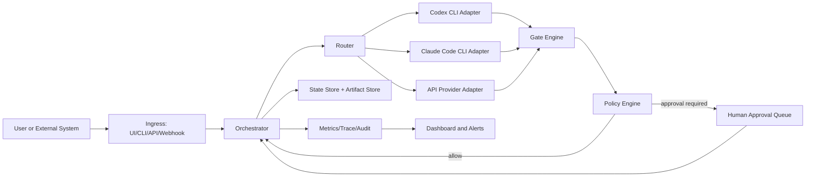
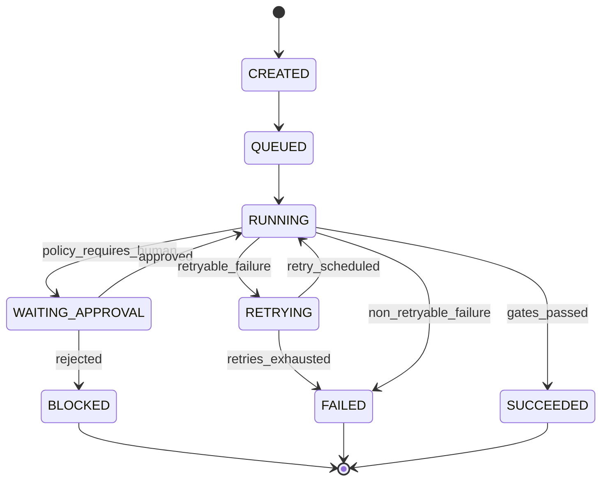

# Báo Cáo Đánh Giá 7 Tầng Harness Cho `AINative_OKR_Claude_GHCP`

## Phạm Vi

Report này chỉ đánh giá `AINative_OKR_Claude_GHCP` theo tiêu chuẩn harness độc lập.

Mục tiêu là trả lời 3 câu hỏi:

1. Vì sao `AINative_OKR_Claude_GHCP` có thể được gọi là "AI-native"?
2. Vì sao nó chưa nên được gọi là "harness" theo nghĩa kỹ thuật nghiêm túc?
3. Muốn biến nó thành harness thật thì cần bổ sung gì theo 7 tầng H1-H7?

## Kết Luận Executive

`AINative_OKR_Claude_GHCP` là một **AI SDLC workflow package** khá mạnh:

- Có nhiều agent chuyên trách.
- Có command wrappers cho Claude Code và GitHub Copilot.
- Có Spec-Kit memory/scripts/templates.
- Có SRS/BD/DD/test/review flow.
- Có `okr.bossbuiltin` làm prompt-level orchestrator.
- Có tài liệu yêu cầu và kiến trúc OKR app.

Nhưng nó **chưa phải AI harness đúng nghĩa** vì thiếu lớp runtime bên ngoài model để:

- tự tạo và quản lý run state;
- tự chạy phase theo config;
- tự enforce quality gates;
- tự audit tool/command;
- tự đo cost/latency/retry;
- tự block hoặc escalate khi fail;
- tự áp security/governance policy.

Nói ngắn gọn:

```text
AI-native: Có, mức tốt.
Prompt/agent workflow: Có, mức tốt.
Harness runtime: Chưa đủ.
Production-grade harness: Chưa.
```

## Phương Pháp Luận

### 1. Định nghĩa "harness" dùng trong report

Trong software testing, ISTQB định nghĩa test harness là một môi trường test gồm drivers/stubs cần để thực thi test. IBM cũng mô tả test harness là nơi chứa đủ thông tin để compile/run test, gồm test cases, source under test, stubs và cấu hình run. Xem: [ISTQB Test Harness](https://istqb-glossary.page/test-harness/) và [IBM Test Harness Structure](https://www.ibm.com/docs/en/devops-test-embedded/9.0.0?topic=components-test-harness-structure).

Suy ra cho AI harness:

> Một AI harness không chỉ là prompt. Nó phải là một runtime/control environment có khả năng execute, observe, verify, retry, audit, và govern agent runs.

Vì vậy, trong report này, một folder có nhiều prompt/agent **chưa đủ** để được chấm là harness. Nó chỉ được chấm cao khi có enforcement ngoài model.

### 2. Tiêu chí gate/evaluation

SonarQube định nghĩa quality gate là tập điều kiện dùng để đo code; kết quả pass/fail cho biết developer nên sửa hay merge. Xem: [SonarQube Quality Gates](https://docs.sonarsource.com/sonarqube-server/quality-standards-administration/managing-quality-gates/introduction-to-quality-gates).

OpenAI cũng mô tả evals là structured tests để đo model outputs theo tiêu chí mong muốn, nhằm tăng reliability của LLM applications. Xem: [OpenAI Evals Guide](https://developers.openai.com/api/docs/guides/evals) và [OpenAI Evaluation Best Practices](https://developers.openai.com/api/docs/guides/evaluation-best-practices).

Suy ra:

> Review agent nói "quality good" chưa đủ. Harness phải có criteria, measurement, pass/fail result, và action khi fail.

### 3. Tiêu chí risk/security/governance

NIST AI RMF tổ chức quản trị rủi ro AI quanh các function Govern, Map, Measure, Manage. Xem: [NIST AI RMF](https://www.nist.gov/itl/ai-risk-management-framework) và [NIST AI RMF 1.0 PDF](https://nvlpubs.nist.gov/nistpubs/ai/nist.ai.100-1.pdf).

OWASP GenAI/LLM Top 10 liệt kê các rủi ro như prompt injection, sensitive information disclosure, excessive agency, insecure plugin/tool design. Xem: [OWASP Top 10 for LLM Applications](https://owasp.org/www-project-top-10-for-large-language-model-applications/) và [OWASP GenAI Security Project](https://genai.owasp.org/llm-top-10/).

NIST SSDF nhấn mạnh secure software practices cần được tích hợp vào SDLC, không chỉ viết sau trong tài liệu. Xem: [NIST SSDF](https://csrc.nist.gov/projects/ssdf).

Suy ra:

> AI harness cần security/governance ở runtime: policy, approval, scan, audit, block. Nếu chỉ có guideline trong prompt thì chưa đạt.

### 4. Tiêu chí observability/AgentOps

OpenTelemetry mô tả traces là cách thấy đường đi của request qua application. Xem: [OpenTelemetry Traces](https://opentelemetry.io/docs/concepts/signals/traces/).

LangSmith docs nói LLM observability cần visibility từ individual traces tới production metrics. Xem: [LangSmith Observability](https://docs.langchain.com/langsmith/observability).

Suy ra:

> AI harness phải biết agent đã làm gì, tốn bao nhiêu, fail ở đâu, retry mấy lần, tool nào được gọi, output nào sinh ra.

### 5. Thang điểm

Mỗi tầng H1-H7 được chấm theo thang 0-5:


| Điểm | Ý nghĩa                                                                                          |
| -----: | -------------------------------------------------------------------------------------------------- |
|      0 | Không có bằng chứng                                                                            |
|      1 | Có claim/prompt/tài liệu, chưa có thực thi                                                   |
|      2 | Có static assets/scripts/templates, nhưng chưa enforce runtime                                  |
|      3 | Có runtime tối giản, chạy được và có pass/fail cơ bản                                   |
|      4 | Có runtime khá đầy đủ: state, gates, audit, retry, metrics                                   |
|      5 | Production-grade: policy, security, observability, governance, CI/dashboard integration đầy đủ |

Nguyên tắc chấm:

```text
Prompt instruction < static script/template < executable config < enforced runtime < audited governed runtime
```

## Bằng Chứng Từ `AINative_OKR_Claude_GHCP`

### Tài sản AI-native hiện có


| Loại tài sản                  | Bằng chứng                                                  |
| -------------------------------- | ------------------------------------------------------------- |
| Claude agents                    | 18 file trong`.claude/agents`                                 |
| Claude command wrappers          | 14 file trong`.claude/commands`                               |
| GitHub Copilot agents            | 20 file trong`.github/agents`                                 |
| Spec-Kit runtime assets          | 21 file trong`.specify`                                       |
| Shared protocols/steps/templates | 15 file trong`.claude/agents/protocols`, `steps`, `templates` |
| Tổng số file gồm hidden dirs  | 126 file                                                      |
| Requirement source               | `docs/input/okr-requirement.md`                               |
| Change requests                  | `docs/input/change-request/*`                                 |
| Target architecture              | `docs/technical_architecture.md`                              |

### Tài sản harness/runtime còn thiếu


| Cần có để gọi là harness thật         | Trạng thái               |
| -------------------------------------------- | -------------------------- |
| Harness config riêng như`harness.okr.yaml` | Chưa có                  |
| External phase state machine                 | Chưa có trong OKR folder |
| Runtime gate report chuẩn                   | Chưa có                  |
| Tool audit log                               | Chưa có                  |
| Security scan runtime                        | Chưa có                  |
| Governance approval/risk policy              | Chưa có                  |
| AgentOps metrics                             | Chưa có                  |
| Backend/frontend app source                  | Chưa có                  |
| Docker Compose implementation                | Chưa có                  |
| Build/typecheck/lint/test scripts            | Chưa có                  |

## Tổng Điểm Theo 7 Tầng


| Tầng | Tên                  | Điểm | Nhận định                                                                                |
| ----- | --------------------- | -----: | ------------------------------------------------------------------------------------------- |
| H1    | Context Harness       |    2/5 | Context source nhiều, nhưng chưa có context builder/runtime packet                      |
| H2    | Tool Harness          |    1/5 | Tool control chủ yếu nằm trong prompt, chưa có audit/policy thực thi                  |
| H3    | Evaluation Harness    |  1.5/5 | Có review/test agents, nhưng thiếu deterministic gates                                   |
| H4    | Security Harness      |  1.5/5 | Có security guidance trong architecture, chưa có scanner/enforcer runtime                |
| H5    | Governance Harness    |    1/5 | Có protocol text, chưa có approval/risk runtime                                          |
| H6    | AgentOps Harness      |    1/5 | Có nhiều agent identity, chưa đo metrics runtime                                        |
| H7    | Orchestration Harness |    2/5 | Có`okr.bossbuiltin`, nhưng là prompt orchestrator, không phải external harness runtime |

Điểm trung bình: **~1.4/5**

Diễn giải:

```text
Chất lượng agent workflow: tốt.
Chất lượng harness runtime: thấp.
```

## H1 - Context Harness

### Tiêu chuẩn đánh giá

H1 phải trả lời: mỗi phase lấy context nào, vì sao, từ đâu, có log lại không?

Một H1 tốt cần:

- repo map;
- requirement input;
- change requests;
- architecture docs;
- rules/constitution;
- previous artifacts;
- previous failures;
- generated context packet per phase;
- audit trail cho context đã đưa vào agent.

Điều này đi theo tinh thần harness/test environment: môi trường phải chuẩn bị đủ inputs và dependencies để execution repeatable, không chỉ hy vọng agent tự tìm đúng file. Tham chiếu khái niệm harness từ [ISTQB](https://istqb-glossary.page/test-harness/) và [IBM](https://www.ibm.com/docs/en/devops-test-embedded/9.0.0?topic=components-test-harness-structure).

### Bằng chứng trong OKR source

Có context source rất tốt:

```text
AINative_OKR_Claude_GHCP/CLAUDE.md
AINative_OKR_Claude_GHCP/README.md
AINative_OKR_Claude_GHCP/docs/input/okr-requirement.md
AINative_OKR_Claude_GHCP/docs/input/change-request/*.md
AINative_OKR_Claude_GHCP/docs/technical_architecture.md
AINative_OKR_Claude_GHCP/.specify/memory/constitution.md
AINative_OKR_Claude_GHCP/.specify/templates/*.md
AINative_OKR_Claude_GHCP/.claude/agents/protocols/*.md
```

### Vì sao chưa đạt harness

Các file này là tài sản context, nhưng chưa có runtime chịu trách nhiệm:

- gom đúng context theo từng phase;
- tạo context packet;
- version context theo run;
- ghi lại context nào đã dùng;
- phát hiện context conflict;
- cắt context theo budget/token;
- buộc agent dùng source mới nhất.

### Điểm

**2/5**

Lý do: nguồn context mạnh, nhưng vẫn là static assets và prompt convention.

### Cần sửa

Thêm context manifest:

```yaml
context:
  global:
    - CLAUDE.md
    - README.md
    - docs/technical_architecture.md
    - .specify/memory/constitution.md
  requirements:
    - docs/input/okr-requirement.md
    - docs/input/change-request/*.md
  protocols:
    - .claude/agents/protocols/*.md
```

Thêm output:

```text
.specify/runs/<run-id>/context/<phase>.context.md
.specify/runs/<run-id>/context/<phase>.context.json
```

## H2 - Tool Harness

### Tiêu chuẩn đánh giá

H2 phải kiểm soát tool/command thay vì để agent tự do chạy.

Một H2 tốt cần:

- allowlist/denylist;
- timeout;
- cwd boundary;
- command risk classifier;
- audit log;
- approval cho command nguy hiểm;
- policy cho Docker/DB/file deletion;
- retry/idempotency behavior.

OWASP LLM Top 10 có các rủi ro liên quan tới excessive agency và insecure plugin/tool design. Vì vậy agent có tool access mà không có policy/audit là rủi ro hệ thống. Xem [OWASP Top 10 for LLM Applications](https://owasp.org/www-project-top-10-for-large-language-model-applications/).

### Bằng chứng trong OKR source

Có các prompt/protocol liên quan tới flow:

```text
.claude/agents/protocols/gate-retry-protocol.md
.claude/agents/protocols/implement-delegation.md
.claude/agents/protocols/report-gate-protocol.md
.claude/agents/steps/steps-10-12-implement.md
```

### Vì sao chưa đạt harness

Những protocol này hướng dẫn agent, nhưng không enforce ngoài model:

- không có `tool-policy.yaml`;
- không có `tool-audit.jsonl`;
- không có deny destructive command;
- không có approval gate cho `docker compose down -v`, DB reset, migration destructive;
- không có timeout/risk tag chuẩn cho command.

### Điểm

**1/5**

Lý do: chủ yếu là prompt-level tool discipline.

### Cần sửa

Thêm policy:

```yaml
tools:
  allow:
    - read_file
    - write_file
    - run_shell
  shell:
    timeout_seconds: 600
    deny:
      - "rm -rf /"
      - "git reset --hard"
      - "docker compose down -v"
      - "prisma migrate reset --force"
    require_approval:
      - "docker compose down"
      - "prisma migrate deploy"
      - "npm audit fix --force"
```

Thêm audit:

```text
.specify/runs/<run-id>/tools/tool-audit.jsonl
```

## H3 - Evaluation Harness

### Tiêu chuẩn đánh giá

H3 phải có measurable evaluation.

Theo SonarQube, quality gate là tập điều kiện đo được và cho pass/fail. Theo OpenAI, evals là structured tests để đo output của model/app theo criteria. Xem [SonarQube Quality Gates](https://docs.sonarsource.com/sonarqube-server/quality-standards-administration/managing-quality-gates/introduction-to-quality-gates) và [OpenAI Evals Guide](https://developers.openai.com/api/docs/guides/evals).

Một H3 tốt cần:

- artifact gates;
- no unresolved marker gates;
- build/typecheck/lint/test gates;
- acceptance/e2e gates;
- review gates;
- eval dataset/golden cases;
- structured pass/fail report;
- retry trigger khi fail.

### Bằng chứng trong OKR source

Có review/test agents:

```text
okr.reviewspec
okr.reviewplan
okr.reviewcode
okr.testkit
speckit.analyze
```

Flow README mô tả các step review/test:

```text
STEP 5  okr.reviewspec
STEP 7  okr.reviewplan
STEP 11 okr.reviewcode
STEP 12 okr.testkit
```

### Vì sao chưa đạt harness

Đây là điểm quan trọng: review/test agent khác với evaluation harness.

Review agent có thể nói "PASS", nhưng harness đúng nghĩa cần tự kiểm tra:

```text
docs/output/ipa-docs/srs/**/*.md exists
docs/output/ipa-docs/bd/**/*.md exists
docs/output/ipa-docs/dd/**/*.md exists
specs/**/spec.md exists
specs/**/plan.md exists
specs/**/tasks.md exists
no "[NEEDS CLARIFICATION]"
npm run build passes
npm run typecheck passes
npm test passes
npx playwright test passes
docker compose healthcheck passes
```

Hiện tại OKR folder chưa có harness config chứa các gate này.

### Điểm

**1.5/5**

Lý do: process review/test mạnh, nhưng enforcement yếu.

### Cần sửa

Tạo `harness.okr.yaml` với deterministic gates:

```yaml
phases:
  - name: boss-flow
    command: "/okr.bossbuiltin {feature}"
    gates:
      - { name: srs-docs, type: glob_nonempty, params: { glob: "docs/output/ipa-docs/srs/**/*.md" } }
      - { name: bd-docs, type: glob_nonempty, params: { glob: "docs/output/ipa-docs/bd/**/*.md" } }
      - { name: dd-docs, type: glob_nonempty, params: { glob: "docs/output/ipa-docs/dd/**/*.md" } }
      - { name: spec, type: glob_nonempty, params: { glob: "specs/**/spec.md" } }
      - { name: plan, type: glob_nonempty, params: { glob: "specs/**/plan.md" } }
      - { name: tasks, type: glob_nonempty, params: { glob: "specs/**/tasks.md" } }
      - { name: build, type: shell, params: { cmd: "${project.build}" } }
      - { name: test, type: shell, params: { cmd: "${project.test}" } }
```

## H4 - Security Harness

### Tiêu chuẩn đánh giá

H4 phải kiểm tra security ngoài model.

Nguồn tham chiếu:

- OWASP GenAI/LLM Top 10: prompt injection, sensitive information disclosure, excessive agency, insecure plugin/tool design.
- NIST SSDF: secure software practices cần tích hợp vào SDLC.
- NIST AI RMF: rủi ro AI cần được govern/map/measure/manage.

Xem [OWASP LLM Top 10](https://genai.owasp.org/llm-top-10/), [NIST SSDF](https://csrc.nist.gov/projects/ssdf), [NIST AI RMF](https://www.nist.gov/itl/ai-risk-management-framework).

Một H4 tốt cần:

- secret scan;
- dependency audit;
- prompt injection scan;
- unsafe command scan;
- auth/RBAC tests;
- leakage tests;
- supply-chain checks;
- security report artifact.

### Bằng chứng trong OKR source

`docs/technical_architecture.md` và `CLAUDE.md` có nhiều security design rules:

- JWT auth;
- HttpOnly cookies;
- bcrypt;
- Prisma parameterized queries;
- role enforcement;
- input validation;
- CORS;
- rate limiting;
- không trả password trong API response.

### Vì sao chưa đạt harness

Security design tốt nhưng chưa có:

- implementation code;
- security test suite;
- `npm audit` gate;
- secret scanner;
- prompt injection scanner;
- RBAC e2e tests;
- generated security report;
- release-blocking security policy.

### Điểm

**1.5/5**

Lý do: security architecture có ý thức tốt, nhưng chưa enforce.

### Cần sửa

Thêm security gates:

```yaml
project:
  security: >
    npm --prefix backend audit --audit-level=high &&
    npm --prefix frontend audit --audit-level=high &&
    npm run test:security
```

Thêm test bắt buộc:

```text
auth.login.valid
auth.login.invalid
auth.refresh.cookie_http_only
rbac.admin.full_access
rbac.manager.team_access
rbac.employee_own_objectives_only
api.no_password_in_response
```

## H5 - Governance Harness

### Tiêu chuẩn đánh giá

H5 kiểm soát quyết định, không chỉ kiểm tra kỹ thuật.

Theo NIST AI RMF, governance là function xuyên suốt để quản lý rủi ro AI. Xem [NIST AI RMF](https://www.nist.gov/itl/ai-risk-management-framework).

Một H5 tốt cần:

- risk classification;
- approval workflow;
- policy registry;
- escalation;
- exception tracking;
- release signoff;
- immutable audit trail.

### Bằng chứng trong OKR source

Có protocol/report templates:

```text
.claude/agents/protocols/auto-resolve-protocol.md
.claude/agents/protocols/gate-retry-protocol.md
.claude/agents/protocols/report-gate-protocol.md
.claude/agents/templates/pipeline-completion.md
.claude/agents/templates/report-templates.md
```

### Vì sao chưa đạt harness

Các file này là hướng dẫn flow, chưa phải governance runtime.

Thiếu:

- approval artifact;
- risk register;
- policy-as-code;
- release approval;
- block rule cho critical risk;
- audit log không sửa được.

### Điểm

**1/5**

Lý do: có governance language trong prompt/protocol, chưa có governance mechanism.

### Cần sửa

Thêm:

```yaml
governance:
  risk_policy:
    low: continue
    medium: continue_with_record
    high: require_approval
    critical: block
  approvals:
    required_for:
      - database_reset
      - destructive_migration
      - dependency_force_fix
      - release
```

Output:

```text
.specify/runs/<run-id>/governance/risk-register.md
.specify/runs/<run-id>/governance/approvals.json
.specify/runs/<run-id>/ESCALATION.md
```

## H6 - AgentOps Harness

### Tiêu chuẩn đánh giá

H6 đo operation của agent.

OpenTelemetry traces giúp hiểu đường đi của request qua system. LangSmith mô tả LLM observability là visibility từ trace đơn lẻ tới metrics production. Xem [OpenTelemetry Traces](https://opentelemetry.io/docs/concepts/signals/traces/) và [LangSmith Observability](https://docs.langchain.com/langsmith/observability).

Một H6 tốt cần:

- run id;
- phase id;
- agent id;
- provider/model;
- latency;
- token/cost;
- retry count;
- failure reason;
- tool calls;
- artifact links;
- dashboard-ready metrics.

### Bằng chứng trong OKR source

Có agent identity rất rõ:

```text
okr.srs
okr.bd
okr.dd
okr.srsallsystem
okr.reviewspec
okr.reviewplan
okr.reviewcode
okr.testkit
okr.bossbuiltin
speckit.specify
speckit.clarify
speckit.plan
speckit.tasks
speckit.implement
```

### Vì sao chưa đạt harness

Chưa có metrics runtime:

- không biết mỗi agent tốn bao nhiêu cost;
- không biết latency từng step;
- không biết retry count chuẩn;
- không có trace tree;
- không có tool call record;
- không có dashboard metrics schema.

### Điểm

**1/5**

Lý do: agent taxonomy tốt, observability runtime chưa có.

### Cần sửa

Thêm metrics schema:

```json
{
  "run_id": "okr-2026-06-29-001",
  "target": "AINative_OKR_Claude_GHCP",
  "provider": "claude",
  "phases": [
    {
      "name": "review-code",
      "agent": "okr.reviewcode",
      "attempt": 1,
      "status": "passed",
      "duration_ms": 120000,
      "cost_usd": 0.42,
      "tool_calls": 18,
      "failed_gates": []
    }
  ]
}
```

Output:

```text
.specify/runs/<run-id>/agentops/metrics.json
.specify/runs/<run-id>/traces/trace.jsonl
```

## H7 - Orchestration Harness

### Tiêu chuẩn đánh giá

H7 là state machine điều phối flow ngoài model.

Một H7 tốt cần:

- phase sequence hoặc DAG;
- phase config;
- retry/repair loop;
- resume;
- skip-if-exists;
- provider routing;
- gate execution;
- escalation;
- dashboard/API integration.

### Bằng chứng trong OKR source

OKR source có `okr.bossbuiltin`, mô tả flow 13 bước:

```text
STEP 1  okr.srs
STEP 2  okr.bd
STEP 3  speckit.specify
STEP 4  speckit.clarify
STEP 5  okr.reviewspec
STEP 6  speckit.plan
STEP 7  okr.reviewplan
STEP 8  okr.dd
STEP 8b okr.testkit gen-testcases
STEP 9  speckit.tasks
STEP 10 speckit.implement
STEP 11 okr.reviewcode
STEP 12 okr.testkit run-tests
STEP 13 launch
```

### Vì sao chưa đạt harness

`okr.bossbuiltin` là prompt orchestrator. Nó có thể rất hữu ích, nhưng vẫn nằm trong model behavior.

Thiếu external orchestration:

- không có YAML/JSON phase state;
- không có per-phase runtime retry ngoài model;
- không có machine-readable phase result;
- không có per-phase gate enforcement;
- không có resume contract;
- không có dashboard status contract.

### Điểm

**2/5**

Lý do: orchestration design rõ, nhưng runtime control chưa tách khỏi prompt.

### Cần sửa

Giai đoạn đầu dùng Boss mode:

```yaml
phases:
  - name: okr-boss
    command: "/okr.bossbuiltin {feature}"
    max_attempts: 1
```

Sau đó chuyển Expanded mode:

```yaml
phases:
  - name: srs
    command: "/okr.srs"
  - name: basic-design
    command: "/okr.bd"
  - name: specify
    command: "/speckit.specify {feature}"
  - name: clarify
    command: "/speckit.clarify"
  - name: review-spec
    command: "/okr.reviewspec"
  - name: plan
    command: "/speckit.plan {tech_stack}"
  - name: review-plan
    command: "/okr.reviewplan"
  - name: detail-design
    command: "/okr.dd"
  - name: generate-tests
    command: "/okr.testkit gen-testcases"
  - name: tasks
    command: "/speckit.tasks"
  - name: implement
    command: "/speckit.implement"
  - name: review-code
    command: "/okr.reviewcode"
  - name: run-tests
    command: "/okr.testkit run-tests"
  - name: launch
    command: "/okr.bossbuiltin launch"
```

## Vì Sao Claim "Harness" Chưa Vững

Harness phải là execution/control environment. `AINative_OKR_Claude_GHCP` hiện có nhiều prompt và agent, nhưng thiếu các đặc tính enforcement:


| Harness property             | Hiện trạng OKR source |
| ---------------------------- | ----------------------- |
| Execute phases outside model | Chưa                   |
| Maintain run state           | Chưa                   |
| Enforce pass/fail gates      | Chưa                   |
| Audit tool calls             | Chưa                   |
| Govern risky actions         | Chưa                   |
| Measure agent operations     | Chưa                   |
| Block release on failure     | Chưa                   |

Vì vậy nên gọi chính xác hơn:

```text
AI OKR SDLC workflow package
Claude/GHCP agent pack
Spec-Kit based OKR source package
```

Không nên gọi là:

```text
production AI harness
```

## Roadmap Để Thành Harness Thật

Roadmap dưới đây là mô hình chung, không phụ thuộc một dự án cụ thể, và áp dụng cho nhiều kiểu executor:

- Codex CLI
- Claude Code CLI
- API AI provider (OpenAI, Anthropic, Azure OpenAI, v.v.)

### Giai đoạn 1 - Unified Execution Layer

Mục tiêu: chuẩn hóa một lớp thực thi duy nhất để orchestration không phụ thuộc công cụ gọi model.

Thiết kế adapter:

- CliExecutorAdapter: gọi các AI CLI theo command template.
- ApiExecutorAdapter: gọi provider API theo SDK/HTTP.
- HybridRouter: chọn CLI hay API theo policy (cost, latency, capability, compliance).

Contract bắt buộc cho mọi adapter:

- input: run_id, phase_id, task_payload, context_bundle, timeout.
- output: content, tool_events, token_usage, cost_estimate, latency_ms, raw_trace_ref.
- error: retryable, non_retryable, policy_blocked.

Exit criteria:

- cùng một phase definition có thể chạy qua Codex CLI, Claude Code CLI, hoặc API mà không đổi orchestrator.

### Giai đoạn 2 - Action Trigger Framework

Mục tiêu: mọi chuyển trạng thái do event/action rõ ràng, không phụ thuộc hành vi ngầm của model.

Trigger classes:

- lifecycle triggers: run_created, phase_started, phase_completed, run_completed.
- quality triggers: gate_failed, gate_passed, quality_regression_detected.
- risk triggers: risky_tool_detected, policy_violation, approval_required.
- ops triggers: timeout_hit, retry_exhausted, provider_unavailable.

Action types:

- auto actions: retry, fallback_provider, reduce_context, switch_mode.
- human actions: approve, reject, request_fix, force_stop.
- system actions: open_incident, emit_alert, publish_report.

Exit criteria:

- mọi trigger đều có action mapping, priority, cooldown, và audit record.

### Giai đoạn 3 - User Interaction Model (cách người dùng vận hành)

Mục tiêu: định nghĩa bề mặt thao tác chung cho cả UI, CLI, API.

User journeys tối thiểu:

1. Start Run: chọn template pipeline, chọn executor strategy, submit input.
2. Monitor Run: xem timeline phase, gate status, chi phí, retry.
3. Handle Intervention: xử lý approval/escalation khi hệ thống yêu cầu.
4. Decide Outcome: accept result, rerun từ phase lỗi, hoặc block release.
5. Postmortem: xem nguyên nhân fail, artifact, đề xuất cải tiến.

Interaction channels:

- Web Dashboard (primary)
- CLI Control Commands (ops users)
- REST/Webhook API (integration với CI/CD, Jira, Slack)

Exit criteria:

- cùng một run có thể được tạo từ API, theo dõi qua dashboard, và can thiệp bằng CLI.

### Giai đoạn 4 - Governance and Policy Runtime

Mục tiêu: áp policy theo runtime, không dựa vào "nhắc nhở" trong prompt.

Policy domains:

- tool execution policy
- data handling policy
- model/provider selection policy
- release and promotion policy

Decision modes:

- allow
- allow_with_audit
- require_approval
- deny

Exit criteria:

- mỗi quyết định policy có evidence: ai, khi nào, rule nào, lý do gì.

### Giai đoạn 5 - Observability and Continuous Optimization

Mục tiêu: đo được hiệu quả giữa CLI và API để tối ưu tự động.

Signals bắt buộc:

- reliability: success_rate, gate_pass_rate, retry_rate.
- performance: p50/p95 latency theo provider và phase.
- economics: token_per_success, cost_per_success.
- risk: approval_rate, policy_block_rate.

Optimization loop:

- detect -> analyze -> change routing/prompt/gates -> evaluate -> rollout.

Exit criteria:

- có bằng chứng định lượng rằng hệ thống tự cải thiện qua các chu kỳ release.

## Mô Hình Luồng Action Tổng Quát



## Trạng Thái Run Chung (Provider-Agnostic)



Nếu chưa có mô hình adapter đa executor, trigger-action framework, interaction channels đa dạng, và state machine provider-agnostic như trên thì chưa đạt mức harness vận hành chung.


## Nguồn Tham Chiếu

- [ISTQB Glossary - Test Harness](https://istqb-glossary.page/test-harness/)
- [IBM - Test Harness Structure](https://www.ibm.com/docs/en/devops-test-embedded/9.0.0?topic=components-test-harness-structure)
- [SonarQube - Quality Gates](https://docs.sonarsource.com/sonarqube-server/quality-standards-administration/managing-quality-gates/introduction-to-quality-gates)
- [OpenAI - Working with Evals](https://developers.openai.com/api/docs/guides/evals)
- [OpenAI - Evaluation Best Practices](https://developers.openai.com/api/docs/guides/evaluation-best-practices)
- [NIST - AI Risk Management Framework](https://www.nist.gov/itl/ai-risk-management-framework)
- [NIST - AI RMF 1.0 PDF](https://nvlpubs.nist.gov/nistpubs/ai/nist.ai.100-1.pdf)
- [NIST - Secure Software Development Framework](https://csrc.nist.gov/projects/ssdf)
- [OWASP - Top 10 for LLM Applications](https://owasp.org/www-project-top-10-for-large-language-model-applications/)
- [OWASP - GenAI Security Project / LLM Top 10](https://genai.owasp.org/llm-top-10/)
- [OpenTelemetry - Traces](https://opentelemetry.io/docs/concepts/signals/traces/)
- [LangSmith - Observability](https://docs.langchain.com/langsmith/observability)
