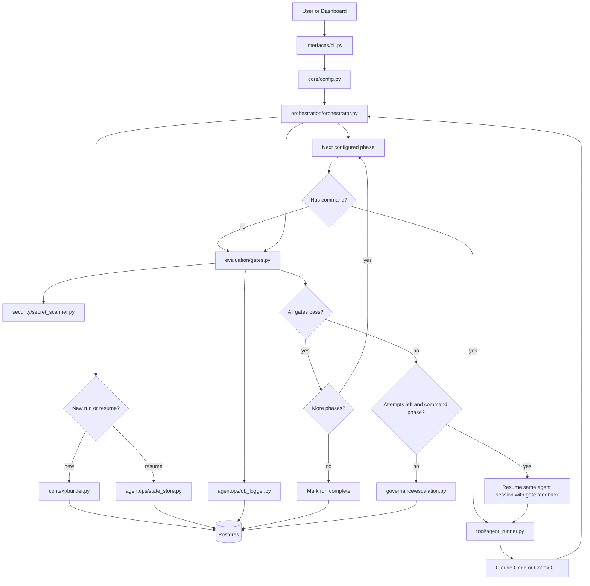

# AI Harness Source Architecture Design

## Purpose

`ai-harness` is the reusable engine that runs AI coding agents inside a controlled SDLC loop. It is not the target application and it is not a prompt pack. It is the outer control plane that:

- loads a target adapter YAML file,
- builds a bounded context packet,
- invokes a configured AI coding provider,
- verifies generated artifacts through deterministic gates,
- retries failed phases with structured feedback,
- escalates runs that cannot self-repair,
- persists state, logs, metrics, and artifacts to Postgres.

The source is organized by harness-engineering layers directly under `src/`.

## Source Tree

```text
packages/ai-harness/
  src/
    cli.py
    __main__.py
    core/
      config.py
    interfaces/
      cli.py
    context/
      builder.py
    tool/
      agent_runner.py
    evaluation/
      gates.py
    security/
      secret_scanner.py
    governance/
      escalation.py
    agentops/
      storage.py
      state_store.py
      db_logger.py
    orchestration/
      orchestrator.py
```

`src/cli.py` is the source-mode entrypoint for `python -m cli`. Installed integrations should use the `harness` console script.

## Layer Model

| Layer | Folder | Responsibility |
| --- | --- | --- |
| Core | `core/` | Typed configuration contracts and YAML loading |
| Interface | `interfaces/` | User-facing entrypoints such as CLI |
| H1 Context | `context/` | Context packet and manifest creation |
| H2 Tool | `tool/` | Provider adapters for AI coding CLIs |
| H3 Evaluation | `evaluation/` | Deterministic phase gates |
| H4 Security | `security/` | Security checks used by gates and future policies |
| H5 Governance | `governance/` | Escalation and approval boundaries |
| H6 AgentOps | `agentops/` | State, artifacts, events, costs, metrics, persistence |
| H7 Orchestration | `orchestration/` | Phase execution, retry, resume, and repair loop |

The layers intentionally point in one direction at runtime:

```text
CLI -> Core config -> H7 orchestration
H7 -> H1 context
H7 -> H2 tool runner
H7 -> H3 evaluation gates
H3 -> H4 security primitives
H7/H3/H5 -> H6 persistence and logging
```

This keeps the orchestration layer in control while smaller layers own specific policies.

## Runtime Flow



## Configuration Contract

The engine is driven by a YAML adapter. Adapters may be target-local for simple projects or package-owned under `packages/ai-harness/targets/<target-id>/` when the target source must stay unchanged.

`core/config.py` loads the file into dataclasses:

- `AgentConfig`
- `Gate`
- `Phase`
- `HarnessConfig`

The minimum shape is:

```yaml
specs_glob: "specs/*"
state_dir: ".specify/state"
runs_dir: ".specify/runs"

agent:
  provider: codex
  bin: codex
  model: ""
  max_turns: 40
  skip_permissions: true
  extra_args: []

project:
  build: "npm run build"
  test: "npm test"

context:
  sources:
    - path: "CLAUDE.md"
      role: "target-guidance"
      required: true

phases:
  - name: implement
    command: "/sdlc.implement"
    max_attempts: 3
    gates:
      - name: build
        type: shell
        params:
          cmd: "${project.build}"
      - name: test
        type: shell
        params:
          cmd: "${project.test}"
```

`${project.key}` placeholders are expanded during config loading. Runtime placeholders such as `{feature}`, `{feature_dir}`, and `{repo}` are expanded during orchestration.

## CLI Interface

`interfaces/cli.py` exposes three commands:

```text
harness run
harness resume
harness status
```

`run` creates a new run ID when one is not provided, loads the target config, and passes CLI context values such as `tech_stack` and `constitution` into H7 orchestration.

`resume` loads run state from Postgres through H6 and re-enters the same configured phase loop.

`status` loads the persisted state and prints current phase, phase status, gate result, attempts, cost, and feature directory.

## H1 Context Harness

`context/builder.py` creates a deterministic context packet before the first agent call.

Input:

- target repository path,
- run ID,
- feature text,
- `context:` configuration block.

Behavior:

1. Expand configured source globs relative to the target repository.
2. Read matching files up to `max_file_bytes` and `max_total_bytes`.
3. Compute SHA-256, byte size, path, role, and required flag per source.
4. Detect missing required source patterns.
5. Store a Markdown context packet in `harness_artifacts`.
6. Store a JSON context manifest in `harness_artifacts`.
7. Return DB artifact references and packet content into run context.

The orchestrator injects the packet into every agent prompt:

```text
Use the controlled harness context below as the authoritative run context...

<context packet>

# Phase Prompt

<phase command>
```

This gives different providers the same bounded source context.

## H2 Tool Harness

`tool/agent_runner.py` is the provider boundary. It returns a normalized `AgentResult`:

```python
AgentResult(
    ok: bool,
    text: str,
    session_id: str | None,
    cost: float,
    raw: object,
)
```

Supported providers:

| Provider | Command strategy |
| --- | --- |
| `claude` | Runs `claude -p ... --output-format json` |
| `codex` | Runs `codex exec --json ...` |

Claude Code can execute slash commands directly. Codex CLI does not natively expand Claude slash commands, so the runner inlines target command files from:

```text
<target repo>/.claude/commands/<command>.md
```

For example, `/sdlc.implement` becomes a normal prompt containing the command file body and arguments.

Resume behavior:

- Claude uses `--resume <session_id>`.
- Codex uses `codex exec resume <session_id> <prompt>`.

This allows the orchestrator to ask the same agent session to repair failed gates.

## H3 Evaluation Harness

`evaluation/gates.py` runs deterministic checks after each phase.

Current gate types:

| Gate type | Meaning |
| --- | --- |
| `shell` | Run a command in the target repo and pass on exit code `0` |
| `glob_nonempty` | Require at least one matching file |
| `no_markers` | Fail if generated files contain configured markers |
| `agent_output` | Fail if provider output contains configured blocking markers |
| `secret_scan` | Delegate to H4 secret scanner |
| `json_no_missing_required` | Fail when H1 reported required context sources missing |
| `db_artifact_exists` | Require a DB artifact ID from runtime context to exist |

Each gate returns `GateOutcome`:

```python
GateOutcome(
    name: str,
    passed: bool,
    report: str,
    type: str,
)
```

The report field is intentionally agent-readable. When a gate fails and attempts remain, H7 sends the report back to the same agent session as repair feedback.

## H4 Security Harness

`security/secret_scanner.py` owns reusable secret scanning logic.

Default patterns detect:

- AWS access key style tokens,
- generic API key, token, password, and secret assignments,
- private key blocks.

The scanner supports:

- filesystem includes,
- filesystem excludes,
- scanning DB artifact content through `db://harness_artifacts/<id>` references.

H3 currently calls H4 through the `secret_scan` gate type. Future security policies should live in H4 rather than inside H7 orchestration.

## H5 Governance Harness

`governance/escalation.py` handles terminal failure.

Escalation happens when:

- a phase still fails after `max_attempts`, or
- a gate-only phase fails and cannot self-repair.

Escalation behavior:

1. Set run status to `escalated`.
2. Persist the state.
3. Write an `ESCALATION.md` artifact into Postgres.
4. Log the escalation event.
5. Optionally create a GitHub issue when `HARNESS_OPEN_ISSUE=1`.

Governance owns this boundary so the orchestrator can stay focused on phase flow.

## H6 AgentOps Harness

H6 is split into three modules.

### `storage.py`

Postgres-first persistence. Required environment:

```text
HARNESS_DB_URL=postgresql://...
```

or:

```text
DATABASE_URL=postgresql://...
```

Tables:

| Table | Purpose |
| --- | --- |
| `harness_runs` | Run metadata, status, cost, feature directory |
| `harness_run_state` | Full resumable state JSON |
| `harness_artifacts` | Context packets, manifests, phase logs, gate logs, escalations |
| `phase_events` | Phase start and completion timeline |
| `gate_outcomes` | Gate pass/fail records |
| `run_events` | General audit event stream |

`storage.init()` is idempotent and creates or migrates the core schema.

### `state_store.py`

Thin facade over `storage` for run state:

- `new_run(...)`
- `load(...)`
- `save(...)`

The state object is the resumable control record:

```python
{
    "run_id": "...",
    "feature": "...",
    "ctx": {...},
    "status": "running",
    "current_phase": "...",
    "feature_dir": "specs/...",
    "phases": {...},
    "cost_usd": 0.0,
    "started_at": "..."
}
```

### `db_logger.py`

Structured telemetry writer for:

- phase started,
- phase done,
- gate outcome,
- run escalated,
- run complete,
- general run events.

If a DB connection is not available, these functions fail soft where possible so logging does not crash pure local CLI workflows. Primary state persistence still requires Postgres.

## H7 Orchestration Harness

`orchestration/orchestrator.py` is the main control loop.

For a new run:

1. Build base context from `feature`.
2. Merge CLI extras such as `tech_stack`.
3. Call H1 to create context packet and manifest.
4. Create initial run state through H6.

For each configured phase:

1. Skip completed phases on resume.
2. Apply `skip_if_exists` when configured.
3. Mark `current_phase`.
4. Start phase event logging.
5. If the phase has a command:
   - expand runtime placeholders,
   - inject H1 context,
   - call H2 provider runner,
   - store phase log artifact,
   - accumulate cost.
6. Discover `feature_dir` when Spec-Kit created a branch-specific specs folder.
7. Run H3 gates.
8. Persist gate logs and gate outcomes.
9. Update phase state.
10. If gates pass, continue to the next phase.
11. If gates fail and attempts remain, resume the same agent session with feedback.
12. If repair is impossible or attempts are exhausted, call H5 escalation.

When all phases pass:

1. Set run status to `complete`.
2. Clear `current_phase`.
3. Persist final state.
4. Log run completion.
5. Print a concise completion summary.

## Retry And Repair Semantics

The harness treats gates as the source of truth.

If an agent command succeeds but gates fail, the run is not considered successful. The gate report becomes the next repair prompt:

```text
The previous attempt did not pass verification.
Fix the following issues, then stop:

<gate failure report>
```

Command phases can self-repair because H2 can resume an agent session. Gate-only phases cannot self-repair, so a failing gate-only phase escalates immediately.

## Artifact Strategy

Artifacts are stored in Postgres instead of local run folders.

Current artifact types include:

- `context_packet`
- `context_manifest`
- `phase_log`
- `gate_log`
- `escalation`

This makes dashboard, CLI status, and future APIs read from one shared source of truth.

## Extension Points

### Add A New Provider

Add a provider branch in `tool/agent_runner.py` that returns `AgentResult`.

Provider adapters should normalize:

- success or failure,
- final text,
- resume session ID,
- cost if available,
- raw provider events.

### Add A New Gate Type

Add a branch in `evaluation/gates.py`.

Rules:

- Keep the gate deterministic where possible.
- Return a concise failure report.
- Make the report useful as repair feedback.
- Move reusable security logic into H4 rather than embedding it in H3.

### Add A New Security Policy

Place the reusable check in `security/`.

Expose it through a gate type or through a future H4 policy runner.

### Add A New Persistence Record

Add schema changes in `agentops/storage.py`.

Use `CREATE TABLE IF NOT EXISTS` and `ALTER TABLE ... ADD COLUMN IF NOT EXISTS` so startup remains idempotent.

### Add A New Interface

Create a module under `interfaces/`.

Interfaces should load config and call H7. They should avoid duplicating phase execution logic.

## Design Principles

- The target repository owns product prompts, source files, build commands, and acceptance criteria.
- The harness owns orchestration, context bounding, provider execution, verification, governance, and persistence.
- Agent output is never trusted by itself. Gates decide whether work passes.
- Failure reports are written for both humans and repair agents.
- Postgres is the system of record for state and artifacts.
- Layer folders should represent real behavior, not only naming convention.

## Current Limitations

- Shell gates still execute through `subprocess.run(..., shell=True)`. Stronger H2 command allow/deny enforcement should be added before production use.
- Context is built once per run. Phase-specific context contracts would reduce prompt size and improve traceability.
- Token usage, latency, and richer provider metrics are not fully normalized yet.
- Approval artifacts for destructive commands are not implemented yet.
- The engine currently assumes sequential phases. A DAG executor could be added later inside H7.

## Development Checklist

When changing the engine:

1. Put code in the layer that owns the behavior.
2. Keep H7 as the coordinator, not the owner of every policy.
3. Preserve `AgentResult`, `GateOutcome`, and state shape compatibility unless a migration is intentional.
4. Add deterministic gates before adding more agent judgment.
5. Keep failure reports actionable.
6. Run import and CLI checks:

```bash
PYTHONPATH=packages/ai-harness/src python -B -m cli --help
```
